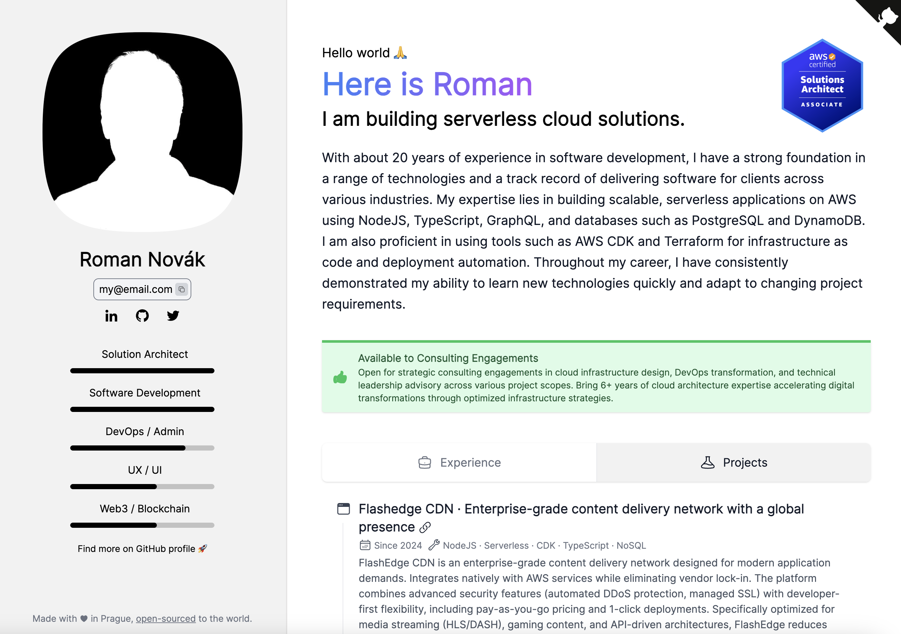

# Hi, I am Roman. This is my Personal Resume Page.

[](https://stackblitz.com/github/romcok/my-astro-landing)
[](https://codesandbox.io/p/sandbox/github/romcok/my-astro-landing)

This repository contains the source code for my resume website generated using the JSON Resume format, a community-driven standard for representing resume data in JSON. All resume details are stored in the `resume.json` file following the JSON Resume schema, making it easy to update and maintain.


> Just rename and change example files in root folder to get your personal resume.

## 🔧 Configuration
```JSON
{
  "title": "Here is Roman",
  "description": "I am building serverless cloud solutions.",
  "photoImage": "photo.jpg",
  "available": false,
  "availabilityTitle": "Available to Consulting Engagements",
  "availabilityDescription": "",
  "badgeImage": "",
  "badgeLink": "",
  "cloudflareToken": "",
  "cloudflareAnalyticsToken": "",
  "githubAccount": "https://github.com/romcok",
  "githubRepository": "https://github.com/romcok/my-astro-resume"
}
```

## 🚀 Example
View an example [here](https://resume.romcok.com)


## 👷 Installation

Run the following command in your terminal ***(If you don't have pnpm use npm instead)***

```bash
pnpm install
```

Once the packages are installed you are ready to run astro. Astro comes with a built-in development server that has everything you need for project development. The astro dev command will start the local development server so that you can see your new website in action for the very first time.

```bash
pnpm dev
```

## 🚚 Deployment

```bash
pnpm run login
pnpm run deploy
```

## 🧞 Commands

All commands are run from the root of the project, from a terminal:

| Command                | Action                                           |
| :--------------------- | :----------------------------------------------- |
| `npm install`          | Installs dependencies                            |
| `npm run dev`          | Starts local dev server at `localhost:3000`      |
| `npm run build`        | Build your production site to `./dist/`          |
| `npm run preview`      | Preview your build locally, before deploying     |
| `npm run astro ...`    | Run CLI commands like `astro add`, `astro check` |
| `npm run astro --help` | Get help using the Astro CLI                     |


## License
This module is released under the MIT License.
